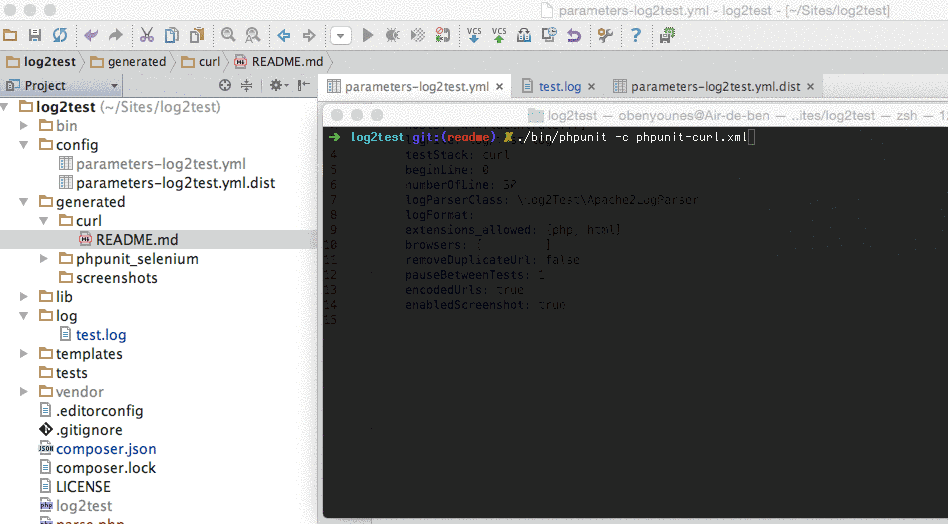

# log2test

[](https://packagist.org/packages/ousamabenyounes/log2test)  [](https://travis-ci.org/ousamabenyounes/log2test) [](https://insight.sensiolabs.com/projects/d9e3c01e-7bea-4705-8b0b-f6273dac5b09)

Log2Test is a PHP application that allows you to **transform your Production Log into test**.  
You can export your log to the following stack:  
- **PhpCurl**: A good solution when you only log API calls or if you don't Need to run Javascript or Ajax calls  
- **PhpunitSelenium**: You can define browsers you want to test  

Why exporting your log production's files to tests?

- Be able to **find broken links**  
- Detect Blank/Empty web pages (When a 500 error occurs and no error redirection page is enabled)
- Before sending new features in production, you can **easily launch real tests for your pre-production**  
- Launching all your access log on different browsers with Selenium allows you to **validate Cross Browser Compatibility**  


**Let's now see how Log2Test works step by step as seen on screencast gif file bellow**
- At the beginning, **no existing tests** on "generated/curl" directory
- Given this context:  
  - A configuration file (Yaml File) -> config/parameters-log2test.yml   
  - An Apache2 Access Log file -> log/test.log   
- Running **./bin/log2test** command will **generate all your curl tests**  
- Now you can Launch all your curl tests -> run ./bin/phpunit -c phpunit-curl.xml  

</img>


# Install

```
git clone https://github.com/ousamabenyounes/log2test 
composer install
```


# Configuration

Open configuration file:  

```
config/parameters-log2test.yml 
```


Here are all configuration's file properties:

| Property | Type | Description | Default | 
|:----------:|:-------------:|:-------------:|---------------|
| host | Array | List of host to parse | |
| logFile | String | Path to your acces log File | log/test.log |
| testStack | String | Available test stack: "phpunit_selenium" or "curl" | curl |
| beginLine | Int | Begin parsing at line X | 0 |
| numberOfLine | Int | Number of line to parse | 300 |
| logParserClass | String | Your log parsing class | \Log2Test\Apache2LogParser |
| logFormat | String | Detail the log format of your acces log file | '%h %l %u %t \"%r\" %>s %b' |
| extensions_allowed | Array | Only parse file matching these extentions | [php, html] |
| browsers | Array | List of browsers -> only for phpunit_selenium stack | chrome |  
| removeDuplicateUrl | Boolean | If you want to remove duplicate urls | true |
| pauseBetweenTests | Int | Add a pause between all generated tests | 0 |
| encodedUrls | Boolean | Allows you to encode all parsed urls | true |
| enabledScreenshot | Boolean | Take screenshot on each test | false |


# Requirements
Phpunit  
Selenium Server (only needed if you choose phpunit_selenium for your test stack)  


# Test
Log2test is tested with phpunit dedicated tests  
Just run following command:

```
./bin/phpunit
```

Tests are built with travis-ci

# Todo
Add screenshot thumbnail  
Add Global Reporting  
Add YellowLabTool option on parsing  
  

