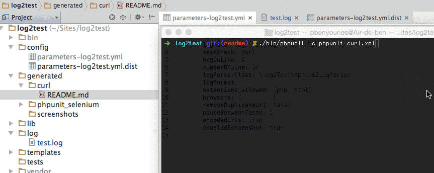

# log2test

[](https://packagist.org/packages/ousamabenyounes/log2test)  [](https://travis-ci.org/ousamabenyounes/log2test) [](https://insight.sensiolabs.com/projects/d9e3c01e-7bea-4705-8b0b-f6273dac5b09)

Log2Test is a PHP application that allows you to **transform your Production Log into test**.  
You can export your log to the following stack:  
- **Curl**: Php Multi Curl Test => A good solution if you have huge apache2 log file or if you don't need to run JavaScript or Ajax calls  
- **PhpunitCurl**:  Phpunit Curl test   
- **PhpunitSelenium**: Allows you to open all your log file urls' on defined browsers you need to test  

Why exporting your production log files to tests?

- Be able to **find broken links**  
- Detect Blank/Empty web pages (When a 500 error occurs and no error redirection page is enabled)
- Before deploying new features to production, you can **easily launch real tests on your pre-production environment**  
- Launching all your access log on different browsers with Selenium allows you to **validate Cross Browser Compatibility**  

# Install

```
git clone https://github.com/ousamabenyounes/log2test 
composer install
```

# How to use

**Let's now see how Log2Test works step by step as seen on the screencast gif file bellow**
- At the beginning, there are **no existing tests** in the "generated/Curl" directory
- Given this context:
  - A configuration file (Yaml File) -> config/parameters-log2test.yml   
  - An Apache2 Access Log file -> log/test.log   
- Running **./bin/log2test** command will **generate and run all your tests**  

</img>

# Configuration

Open configuration file:  

```
config/parameters-log2test.yml 
```


Here are all the configuration file's properties:

| Property | Type | Description | Default | 
|:----------:|:-------------:|:-------------:|---------------|
| host | Array | List of hosts to parse [see samples here](#host-sample) | |
| logFile | String | Path to your access log file | log/test.log |
| testStack | String | Available test stack: "PhpunitSelenium" or "Curl" or "PhpunitCurl | Curl |
| beginLine | Int | Begin parsing at line X | 0 |
| numberOfLine | Int | Number of lines to parse | 300 |
| logParserClass | String | Your log parsing class | \Log2Test\Parser\Log\Apache2LogParser |
| logFormat | String | Detail the log format of your acces log file | '%h %l %u %t \"%r\" %>s %b' |
| extensions_allowed | Array | Only parse files matching these extentions | [php, html] |
| browsers | Array | List of browsers -> only for phpunit_selenium stack | chrome |  
| removeDuplicateUrl | Boolean | If you want to remove duplicate urls | true |
| pauseBetweenTests | Int | Add a pause between all generated tests | 0 |
| encodedUrls | Boolean | Allows you to encode all parsed urls | true |
| enabledScreenshot | Boolean | Take a screenshot on each test | false |
| testResultFormat | string | Test result format "xml" or "json" | xml |


# Requirements
Phpunit  
Selenium Server (only needed if you choose phpunit_selenium as your test stack)  


# Test
Log2test is tested with PHPUNIT & Behat

```
./bin/phpunit 

./bin/behat
```

On each commit, a complete build is launched on http://travis-ci.org/ousamabenyounes/log2test/

### Host Sample

You can provide a simple array of strings like this:

```php
[
    "www.shop2tout.com",
    "www.epitech.fr"
    ...
]
```

You can also provide an array of arrays (source / destination) 

```php
[
    ["www.sourcehost.com", "www.destinationhost.local"],
    ["www.sourcehost2.com", "www.destinationhost2.local"],
    ["www.shop2tout.com", "www.shop2tout.local"],
    ...
]
```

The first case is the source host you will be searching on your apache logs  
The second case is the destination host which will be used on generated tests  
**We recommend using the second format**, so your production website is not affected by the heavy tests.

# Todo
Add Global Reporting  
Add YellowLabTools option on parsing

## Contributors
- Ousama Ben Younes [ousamabenyounes](https://github.com/ousamabenyounes)
- Youval Teboul [youvalteboul](https://github.com/youvalteboul)

